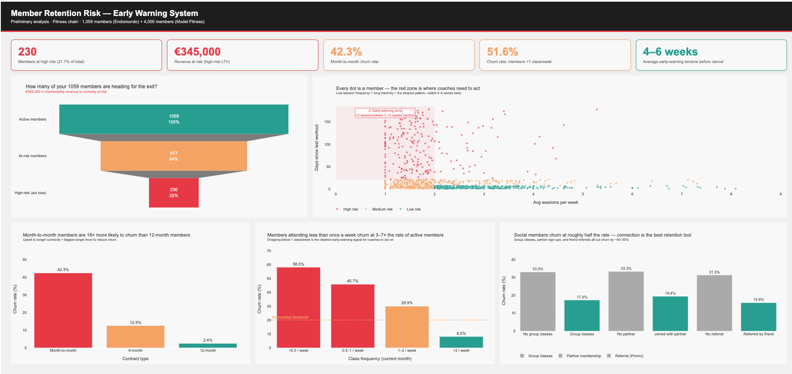

# Dashboard Documentation
**Title:** Member Retention Risk – Early Warning System

## Dashboard versions

| Version | How to access |
|---|---|
| **Plotly/Dash** (primary, interactive) | `python dashboard/plotly_dashboard.py` → http://127.0.0.1:8050 |
| **Tableau Public** (published, no setup) | https://public.tableau.com/authoring/MemberRetentionRiskEarlyWarningSystem/MemberRetentionRiskOverview#1 |

Both versions show the same 5 core views and use the same two datasets. The Plotly version adds KPI cards and hover tooltips; the Tableau version is shareable without running any code.

---

## What this dashboard does

Built for Chleo, CEO of a medium-sized European fitness chain (50–200 studios). The goal is simple: show which members are heading towards the exit *before* they actually leave, and translate that into euros. Everything a coach needs to prioritise outreach — no data science background required.

---

## Data Sources

**Primary:** `data/processed/fitness_user_metrics.csv`
- 1,059 members, 12 columns
- Derived from Endomondo workout logs (167k real sessions, Kaggle)
- Synthetic recency applied to `days_since_last_workout` — anchored to today, correlated with each member's real session frequency

**Supplementary:** `data/raw/gym_churn_us.csv` (Kaggle — "Model Fitness")
- 4,000 members with a real binary churn label (26.5% actual churn rate)
- Adds demographic and structural context: contract length, lifetime as member, group visit behaviour, proximity to studio
- Used in Tableau to show churn breakdowns by contract type and visit frequency — the "who churns" layer alongside the Endomondo "how they behave" layer

See [README.md](../README.md) for the full data pipeline and column definitions.

---

## Sheets / Views

| # | Sheet name | Chart type | Key fields |
|---|---|---|---|
| 1 | Member Retention Risk Overview | Bar chart | COUNT(user_id) by churn_risk |
| 2 | Revenue at Risk by Risk Level | Bar chart | SUM(revenue_at_risk_eur) by churn_risk |
| 3 | Behaviour vs Risk (Engagement Scatter) | Scatter plot | avg_sessions_per_week (x), days_since_last_workout (y), colour by churn_risk |
| 4 | Training Intensity Profile | Bar chart | AVG(avg_duration_min) by churn_risk |
| 5 | Sport Variety vs Risk | Bar chart | AVG(sport_variety) by churn_risk |
| 6 | High-Risk Member List | Table | user_id, avg_sessions_per_week, days_since_last_workout, revenue_at_risk_eur — filtered to churn_risk = "high" |

---

## What the metrics mean for Chleo

| Metric | Why it matters |
|---|---|
| Churn risk (low/medium/high) | Tells coaches where to focus first — not every member needs attention, just the right ones |
| Revenue at risk (€) | Converts behaviour signals into financial stakes — €345K total in this dataset |
| Avg sessions/week | The clearest habit signal — dropping below 1/week is usually the first warning |
| Days since last workout | The most immediate dropout flag — >21 days with no visit is serious |
| Sport variety | Members who try multiple class types engage more and churn less — a loyalty indicator |
| Avg duration (min) | Sessions getting shorter over time can signal someone mentally checking out |

---

## Design choices

- **Titles written for a non-technical CEO** — "How many members are at risk of leaving?" rather than "churn_risk count"
- **Colour convention:** red = high risk, orange = medium, green = low — consistent across every sheet
- **Global filter:** churn_risk multi-select filters all sheets at once
- **Interactivity:** clicking a bar in the overview filters every other view; scatter plot selection highlights the matching rows in the High-Risk Member List

---

## Implementation Notes

### Boxplot caveat
The **Training Intensity Profile** sheet uses `AVG(Avg Duration Min)` by `churn_risk` as a bar chart.
This is the right fallback for Tableau Public web authoring, which doesn't expose box-and-whisker in the same way as Desktop.

> **If opening in Tableau Desktop locally:** switch to a true boxplot by adding `User Id` to the Detail pill, then selecting Box-and-Whisker from Show Me. This shows the full distribution (median, IQR, outliers) per risk group — more useful for a detailed analysis session with coaches.

### Calculated field — churn risk sort order
Forces legend order to high → medium → low (rather than alphabetical):
```
IF [churn_risk] = "high" THEN 1
ELSEIF [churn_risk] = "medium" THEN 2
ELSE 3
END
```

### Data connection
The `.twbx` format packages the CSV inside the workbook — no path dependency once saved.
Original source: `data/processed/fitness_user_metrics.csv` (relative to project root).

---

## How to use it

**Plotly version:**
1. Run `python dashboard/plotly_dashboard.py` from the project root
2. Open http://127.0.0.1:8050 in your browser

**Tableau version:**
1. Open [Member Retention Risk Overview](https://public.tableau.com/authoring/MemberRetentionRiskEarlyWarningSystem/MemberRetentionRiskOverview#1)
2. Use the **Churn Risk** filter (top right) to focus on a specific risk segment
3. Use the **Days Since Last Workout** range slider to narrow by recency
4. Click any bar to cross-filter all other charts
5. Use the High-Risk Member List (sheet 6) to identify specific members for coach outreach

---

## Screenshots


*Plotly/Dash — KPI cards + all 5 charts (funnel, scatter, contract churn, class frequency, social factors)*

---

## What this is — and what it's not

This dashboard uses **proxy data** (real Endomondo workout behaviour from European fitness users) to demonstrate what the system would look like on day one with Chleo's own data. The workout patterns, session frequencies, and sport variety figures are real. The `days_since_last_workout` values have been regenerated to simulate a live, current dataset (the original Endomondo data is from 2015–2016).

In production, the same pipeline runs on the chain's own member check-in and booking data — same logic, same dashboard, real members.
