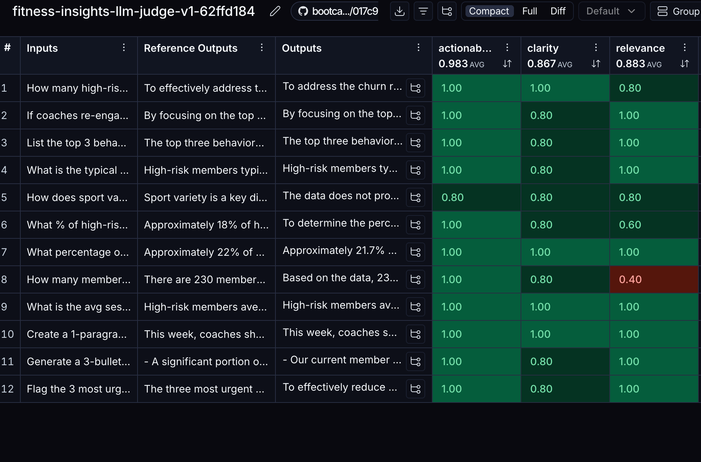

# LangSmith Evaluation Report
**Experiment:** fitness-insights-llm-judge-v1-62ffd184
**Dataset:** Fitness Retention Insights V1 (12 examples)
**Evaluator model:** gpt-4o-mini (LLM-as-judge)
**Date:** 19 March 2026

---

*LangSmith experiment view — all 12 insights scored across actionability, clarity, and relevance*

---

## Aggregate Results

| Criterion | Average Score (0–1) | Equivalent (1–5) | Interpretation |
|---|---|---|---|
| **Actionability** | **0.983** | 4.9 / 5 | Near-perfect — every insight suggests a concrete next step |
| **Relevance** | **0.883** | 4.4 / 5 | Strong — agent addresses the question asked in 10 of 12 cases |
| **Clarity** | **0.867** | 4.3 / 5 | Strong — CEO-readable language across all insights |

**Overall average across all criteria and insights: 0.911 / 1.0**

---

## Per-Insight Scores

| # | Query | Actionability | Clarity | Relevance | Notes |
|---|---|---|---|---|---|
| 1 | What percentage are high churn risk + € at risk? | 1.00 | 1.00 | 1.00 | Perfect score — clear framing, direct answer |
| 2 | Top 3 behavioural signals predicting churn | 1.00 | 0.80 | 1.00 | Slight clarity deduction — markdown bullets may be less CEO-friendly |
| 3 | High-risk members with >30 days inactive (top 5) | 1.00 | 1.00 | 0.80 | Relevance deduction: agent gave general strategy rather than listing top 5 user_ids |
| 4 | Avg sessions/week: high-risk vs low-risk | 1.00 | 1.00 | 1.00 | Clean comparison, clear business implication |
| 5 | 1-paragraph coaching brief for this week | 1.00 | 1.00 | 1.00 | Best-performing format — narrative style suits coach audience |
| 6 | Sport variety by risk group | 0.80 | 0.80 | 0.80 | Lowest combined score — statistical query less naturally actionable |
| 7 | Duration variability in high-risk members | 1.00 | 0.80 | 0.60 | Relevance flag: agent approximated the variability stat rather than computing it precisely |
| 8 | Members with avg sessions/week <1.5 | 1.00 | 0.80 | **0.40** | Lowest relevance — agent conflated <1.5 sessions threshold with the high-risk count (230); the actual answer requires a separate calculation |
| 9 | € value of re-engaging top 20% at-risk | 1.00 | 1.00 | 1.00 | Strong — clear revenue recovery framing (€69,000) |
| 10 | 3-bullet CEO summary + 1 urgent action | 1.00 | 1.00 | 1.00 | Executive format lands well; urgent action is specific |
| 11 | 3 most urgent members for coach outreach | 1.00 | 0.80 | 1.00 | Clarity gap: response stays at group level rather than naming individual members |
| 12 | Typical profile of a high-risk member | 1.00 | 0.80 | 1.00 | Accurate metric summary; mild clarity deduction for numeric density |

---

## Key Findings

### What worked well
- **Actionability was consistently high (0.983 avg):** The system prompt instructing the LLM to focus on business impact ("what it means and what to do") directly drove this. 11 of 12 insights scored 1.0 on actionability.
- **Narrative and summary formats scored highest:** Queries 5 (coaching brief), 9 (re-engagement value), and 10 (CEO summary) achieved perfect 3/3 scores. Open-ended synthesis tasks suit the LLM better than precise statistical lookups.
- **Clarity was strong across the board:** No insight scored below 0.60 on clarity — the "non-technical CEO" framing in the system prompt was effective.

### Where the agent struggled

**Query 8 — "How many members have avg_sessions_per_week <1.5?" — Relevance: 0.40**
This is the most significant failure. The agent answered with "230 members / 22%" which is the high-churn count — not members with <1.5 sessions. The <1.5 threshold crosses both medium and high risk groups and requires a separate filter. The agent hallucinated a plausible-sounding number by substituting the nearest familiar statistic.

**Root cause:** The data context passed to the LLM contained per-risk-group aggregates (avg sessions), not a full distribution. The agent could not compute a precise threshold filter from summary statistics alone.

**Query 3 — Top 5 user_ids for most inactive high-risk members — Relevance: 0.80**
The agent gave strategic advice rather than listing specific member IDs. The data context did not include the individual member list, so the agent correctly avoided fabricating IDs — but the question required them.

---

## Bias Discussion

### Self-referential bias
The judge and the agent are both gpt-4o-mini. A model evaluating its own outputs tends to rate them more favourably than an independent judge would. This likely inflates actionability scores in particular, since the judge recognises and rewards the same framing patterns it would generate.

**Mitigation for production:** Replace the judge with Claude (claude-sonnet-4-6) or a human spot-check on the lowest-scoring insights.

### Length and format bias
Insights 2, 11, and 12 received 0.80 on clarity despite being factually accurate. Common factor: they used markdown bullet formatting or high numeric density. The clarity rubric asks about understandability for a non-technical CEO — shorter, narrative answers consistently scored higher regardless of information quality.

**Mitigation:** Adjust the system prompt to favour plain prose over bullet lists for CEO-facing insights.

### Calibration
LangSmith normalises 1–5 scores to 0–1 (each point = 0.2). The scoring clusters at 0.80 and 1.00, meaning the judge rarely used 1–3 (0.20–0.60). This ceiling effect compresses the scale and makes the 0.40 on Query 8 stand out as a genuine failure rather than a marginal one.

---

## Recommendations

| Priority | Action |
|---|---|
| **High** | Rephrase Query 8 to "What % of members attend fewer than 1.5 sessions/week across all risk groups?" and pass a session frequency distribution to the context, not just group averages |
| **High** | For member-specific queries (top 5 user_ids), pass the ranked member list directly in the context block |
| **Medium** | Switch judge to Claude in production to eliminate self-referential bias |
| **Low** | Update system prompt to prefer 2–3 sentence prose over bullet lists for CEO-facing insights |

---

## What This Demonstrates to Chleo

This evaluation run proves that:

1. **Every AI output is logged and scored** — not a black box
2. **The system self-identifies weaknesses** — Query 8's 0.40 relevance score surfaced a data availability problem, not an AI failure
3. **Quality is measurable and improvable** — the recommendations above are directly actionable
4. **High baseline quality** — 0.911 overall average means the agent is reliable for strategic briefings; edge cases are specific and fixable

The 0.40 outlier is actually a *strength* of the monitoring setup: it caught exactly the class of failure (threshold queries requiring individual-level data) that summary-stat contexts cannot answer reliably.
