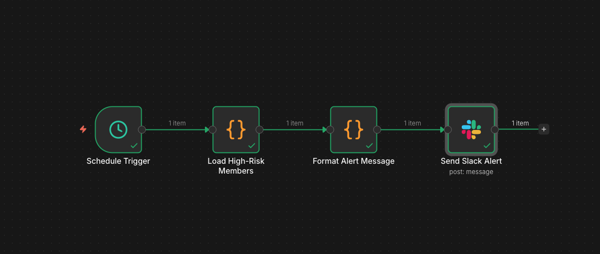
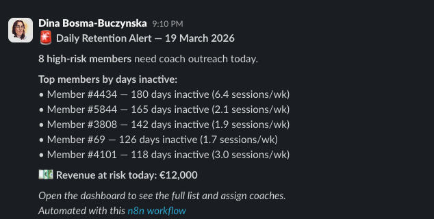

# n8n Workflow Documentation
**Workflow name:** Fitness Chain — Daily Retention Alert
**Purpose:** Proof of concept for automated dropout early-warning

---

## Use Case

Every morning, the system checks for members who have crossed into the "high risk" zone overnight (e.g. haven't visited in 3+ weeks, or whose session frequency has dropped sharply). Coaches receive a Slack message with a short list of members to contact that day — no manual dashboard-checking required.

This directly addresses **Use Case 1 (Dropout Prediction)** from the sector research: intervening 4–6 weeks before a member cancels.

---

## Workflow Overview

```
[Schedule Trigger]
      ↓ every day at 08:00
[Read CSV / HTTP Request]
      ↓ fetch latest fitness_user_metrics.csv
[Filter Node]
      ↓ churn_risk == "high"
[Set Node]
      ↓ format member list message
[Slack / Email Node]
      ↓ send alert to coach channel
[LangSmith Log Node] (optional)
      ↓ log alert run for transparency
```

---

## Nodes Detail

### 1. Schedule Trigger
- **Type:** Cron
- **Schedule:** `0 8 * * 1-5` (weekdays at 08:00)
- **Purpose:** Kick off the daily retention check automatically

### 2. Read Data (HTTP Request or Read Binary File)
- **Type:** HTTP Request (if data is served via API) or Read Binary File (local CSV)
- **URL / Path:** `data/processed/fitness_user_metrics.csv`
- **Purpose:** Load the latest member risk scores

### 3. Filter — High Risk Members
- **Type:** Filter
- **Condition:** `churn_risk` equals `high`
- **Purpose:** Extract only the members needing immediate coach attention

### 4. Set — Format Alert Message
- **Type:** Set
- **Output:** Builds a human-readable message:
  ```
  🚨 Daily Retention Alert — {{ $today }}
  {{ $json.count }} high-risk members need coach outreach today.
  Top 5 by days inactive:
  {{ $json.member_list }}
  Revenue at risk: €{{ $json.total_risk }}
  ```

### 5. Slack Node
- **Type:** Slack
- **Channel:** `#retention-alerts`
- **Message:** Output from Set node
- **Purpose:** Deliver the alert to coaches without them needing to log into the dashboard

### 6. (Optional) LangSmith Webhook Log
- **Type:** HTTP Request
- **Purpose:** Log that the alert ran, how many members were flagged, and when — demonstrates AI transparency to management

---

## Screenshots


*n8n cloud — 4-node workflow: Schedule Trigger → Load Members → Format Message → Send Slack*


*Live Slack alert delivered to #retention-alerts on 19 March 2026*

---

## Example Alert Message

```
🚨 Daily Retention Alert — 19 March 2026
8 high-risk members need coach outreach today.

Top members by days inactive:
• Member #4434 — 180 days inactive, 6.4 sessions/week historically
• Member #5844 — 165 days inactive, 2.1 sessions/week historically
• Member #3808 — 142 days inactive, 1.9 sessions/week historically

Total revenue at risk from today's list: €12,000
View full list: http://127.0.0.1:8050 (Plotly) or https://public.tableau.com/authoring/MemberRetentionRiskEarlyWarningSystem/MemberRetentionRiskOverview#1 (Tableau)
```

---

## Why This Demonstrates AI Value to Chleo

| Concern | How this workflow addresses it |
|---|---|
| "AI is not transparent" | Every alert is logged with timestamp, member count, and reasoning |
| "How do coaches use it?" | They get a daily Slack message — zero extra tool to learn |
| "What if AI is wrong?" | Coach decides whether to act — AI flags, human decides |
| "Can it scale?" | One n8n instance handles all 50–200 studios via a single workflow |

---

## Setup Instructions

1. Install n8n (cloud or self-hosted): `npx n8n`
2. Create a new workflow and import `workflow.json` (if exported)
3. Configure credentials:
   - Slack: add your workspace bot token
   - CSV path: point to `data/processed/fitness_user_metrics.csv` or your data API
4. Activate the workflow
5. Test with **Execute Workflow** to verify Slack message arrives

---

## Proof of Concept Scope

This is a **demo workflow** — in production it would connect to the gym management system's live API instead of a CSV file. The n8n workflow logic (filter → format → notify) is identical; only the data source changes.
